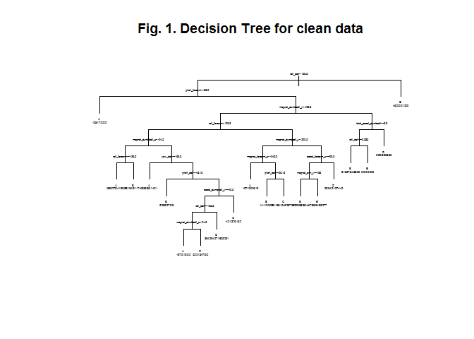

# Machine Learning Project
CVava  
June 15, 2015  

### Synopsis
The purpose of this project is to design an algorithm for **Human Activity Recognition** based on the data sets made available at *groupware.les.inf.puc-rio.br/har* and consisting of recordings made with wearable devices of six participants performing barbell lifts in five different ways while wearing accelerometers on the belt, arm, and dumbell. 

In the end we have selected the **Random Forests** algorithm based on clean data. It provides an *Out of Sample Error* of less than 0.6%.

### Load data
Prepare environment by loading required libraries:

```r
library(caret)
library(rpart)
library(rattle)
library(randomForest)
library(e1071)
```
Read Data Files

```r
train <- read.csv('http://d396qusza40orc.cloudfront.net/predmachlearn/pml-training.csv', header = TRUE, na.strings=c("NA","#DIV/0!",""))
test  <- read.csv('http://d396qusza40orc.cloudfront.net/predmachlearn/pml-testing.csv', header = TRUE, na.strings=c("NA","#DIV/0!",""))
```
The training set has 160 variables and 19622 samples while the testing set has 160 variables and 20 samples. After a quick examination we find out that 61.3% of the overall samples are missing. Because the Random Forests algorithm is sensitive to missing data we cannot apply it to the sets as we have now.

### Clean data

The first stage in cleaning the data consists in eliminating the *index*,  *raw_timestamp_part_1*, *cvtd_timestamp* and *num_window* columns. These variables have no true information value for our analysis and since the set has a fixed number of participants and activities they tend to correlate surprisingly well with the activity type leading to massive overfitting. 


```r
# remove undesired columns
train  <- train[-c(1, 3, 5, 7)]
test  <- test[-c(1, 3, 5, 7)]
```

The training set has some variables with a huge number of missing samples. We can choose to impute those however if there are too many missing samples a variable loses its predictive value and the result will be decided mostly by the imputing algorithm. We have decided to eliminate all variables that have more than 19200 missing values or 97.85% of the total for the training set which at least at this stage of the analysis seems very reasonable. The same variables will have to be removed from the testing set because will have no correspondence anymore.


```r
cTrain <- train[, -which(names(train) %in% names(train[, colSums(is.na(train)) > cleanThresh]))]
cTest <- test[, -which(names(train) %in% names(train[, colSums(is.na(train)) > cleanThresh]))]
```

### Partition data

For cross-validation we have chosen a partitioning ratio of 0.7.


```r
set.seed(2015)

# partition raw data
tTrain <- createDataPartition(y = train$classe, p = partitionRatio, list = FALSE)
rTrain <- train[tTrain, ]
rTest  <- train[-tTrain, ]

# partition clean data
vTrain <- createDataPartition(y = cTrain$classe, p = partitionRatio, list = FALSE)
wTrain <- cTrain[vTrain, ]
wTest  <- cTrain[-vTrain, ]
```

## Decision Tree Algorithm with raw data

```r
fitDTr <- rpart(classe ~ ., data = rTrain, method = "class")
```

**Predicting with Decision Tree**

```r
predictDTr <- predict(fitDTr, rTest, type = "class")
cmDTr <- confusionMatrix(predictDTr, rTest$classe)
```

**Testing Decision Tree Predictions**

The prediction has a low accuracy with a Kappa value of 0.661 in the range of [0.722, 0.744] and a comparison table showing 1571 misclassifications out of the total 5885 possible combinations, an *Out of Sample Error* of 26.7%.


```r
cmDTr$table
```

```
##           Reference
## Prediction    A    B    C    D    E
##          A 1486  181   21   70   38
##          B   74  754  128  110  225
##          C   43   96  816  128   94
##          D   58   93   61  607   74
##          E   13   15    0   49  651
```

## Decision Tree Algorithm with clean data

```r
fitDT <- rpart(classe ~ ., data = wTrain, method = "class")
```

**Predicting with Decision Tree**

```r
predictDT <- predict(fitDT, wTest, type = "class")
cmDT <- confusionMatrix(predictDT, wTest$classe)
```

**Testing Decision Tree Predictions**

The prediction has an even worse accuracy with a Kappa value of 0.616 in the range of [0.683, 0.707] and a comparison table showing 1795 misclassifications out of the total 5885 possible combinations, an *Out of Sample Error* of 30.5%.


```r
cmDT$table
```

```
##           Reference
## Prediction    A    B    C    D    E
##          A 1356  163   24   34   11
##          B   63  668   94   97   92
##          C   36   87  764  161  120
##          D  176  193  120  611  168
##          E   43   28   24   61  691
```


```r
plot(fitDT, uniform=TRUE, margin=0.1, main="Fig. 1. Decision Tree for clean data")
text(fitDT, use.n=T, cex=0.25)
```

 

## Random Forests Algorithm with clean data

```r
fitRF <- randomForest(classe ~ ., data=wTrain, na.action = na.omit)
```

**Predicting with Random Forests**

```r
predictRF <- predict(fitRF, wTest, type = "class")
cmRF <- confusionMatrix(predictRF, wTest$classe)
```

**Testing Random Forests Predictions**

The prediction seems to have an exceptional accuracy with a Kappa value of 0.992 in the range of [0.992, 0.996] and a comparison table showing 35 misclassifications out of the total 5885 possible combinations, an *Out of Sample Error* of 0.595%.

```r
cmRF$table
```

```
##           Reference
## Prediction    A    B    C    D    E
##          A 1669    4    0    0    0
##          B    5 1131    2    0    0
##          C    0    4 1024   16    0
##          D    0    0    0  947    3
##          E    0    0    0    1 1079
```

The most important variables are plotted below.

```r
varImpPlot(fitRF, main="Fig. 2. Importance Plot for Random Forests Prediction", cex=0.8)
```

 


## Selection of the Final Algorithm
By comparing the results of **Decision Tree** predictions based on raw and clean data it becomes obvious that the missing data effect is very low thus validating the selection of the cleaning data algorithm. 

From the figures included we can find out that all variables selected for prediction make sense (as opposed to the ones removed during cleaning). Besides from the available variables a very low number seems to be selected for prediction validating one more time our decision to remove variables with a large ratio of missing data.

The best *Out of Sample Error* is achieved by the **Random Forests** algorithm based on the clean data. Therefore the final algorithm for predicting the activity is **Random Forests**.

